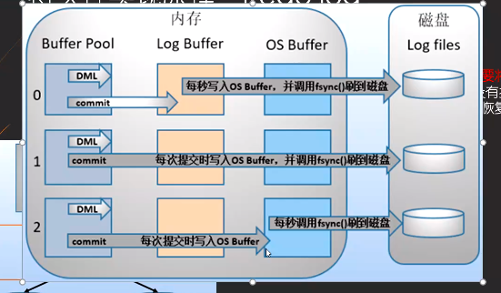
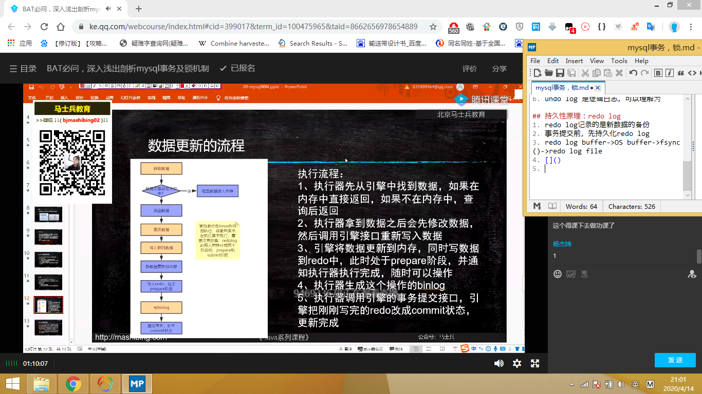

# mysql事务
1. 事务是构成单一逻辑工作单元的操作集合
2. 对一个或多个数据库操作
3. 一个事务一起成功一起失败
4. acid
5. 原子性，通过快照实现
6. 隔离性：并发的事务之间相互不影响，通过锁实现
7. 持久性：事务一旦提交，数据就持久化了，从内存到磁盘了，write ahead log。
8. 一致性：事务的根本追求

## 快照 undo log
1. 数据库日志：undo\redo\bin\relay\slow log
2. undo\redo ->innodb  bin ->server层
3. 原子性实现原理：undo log，在innodb中
4. undo log还实现MVCC，多版本并发控制
5. 数据库做任何动态操作时，都将数据备份到undo log
6. undo log 是逻辑日志，可以理解为

## 持久性原理：redo log
1. redo log记录的是新数据的备份
2. 事务提交前，先持久化redo log
3. redo log buffer->OS buffer->fsync()->redo log file
4. 
5. 

## 隔离级别
1. 脏读：一个事务中读取到其它事务未提交的数据
2. 不可重复读：一个事务中读取到其它事务已提交的数据。一个事务中的多次查询数据不一致
3. 幻读（幻象数据）：

## MVCC
1. RC读最新的快照，RR读旧的快照，
2. 所有表有不可见3列createtime，deleteTime
3. 一个事务查询时，返回  createTime=<当前事务版本号&&(deleteTime==null||deleteTime>=当前事务版本号)  的数据

## 锁
#### innodb加锁是锁索引，只有在通过索引查询时加锁为行锁，否则使用全表扫描为表锁。
1. 间隙锁：为解决幻读引入  [MYSQL（04）-间隙锁详解](https://www.jianshu.com/p/32904ee07e56)
2. 独占、排他：是写锁
3. 共享锁：读锁，只能读，不能写
4. 临键锁：间隙锁+行锁，实现可重复读
5. 自增锁：自增主键插入失败也会增加，数据库保证自增用的
6. 意向锁：细粒度锁向粗粒度锁妥协